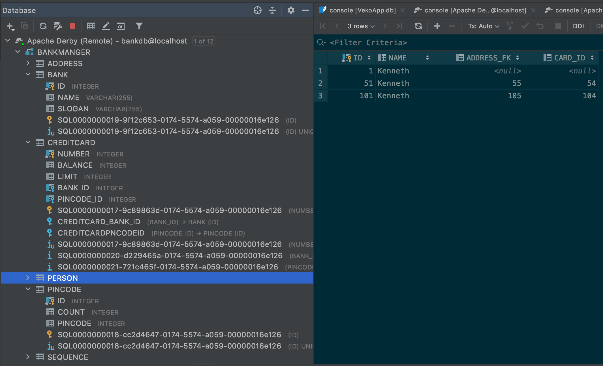

# DAT250: Experience Assignment 2

Author: Kenneth Fossen 577136@stud.hvl.no

## Tasks

| Task | Done |
| --- | --- |
| Installation: Derby Database | :white_check_mark: |
| Experiment 1: Application using JPA | :white_check_mark: |
| Experiment 2: Banking/Credit Card example JPA | :white_check_mark:|

Noting on following topics:

- technical problems that you encountered during installation and use of Java Persistence Architecture (JPA) and how you resolved
- a link to your code for experiment 1 and 2 above
- an explanation of how you inspected the database tables and what tables were created. For the latter you may provide screenshots.
- any pending issues with this assignment which you did not manage to solve

## Installation: Derby Database

```sh
docker pull az82/docker-derby
docker run -p 127.0.0.1:1527:1527/tcp --name apache-derby az82/docker-derby -d

# to start and stop after this
docker start apache-derby
docker stop apache-derby
```

Installed this way because I don't want a DB cluttering up my OS, hence pulling it down in containers is better so I can remove this later with out any problems.

### Experiment 1: Application using JPA

Setup a Java application which uses JPA for storing entities in a database based on the following tutorial:


Clonend the [repo](https://github.com/lmkr/dat250-jpa-examples/tree/master/eclipselink/jpa-basic)
And changed the following in `persistence.xml` to make it work.

```xml
<?xml version="1.0" encoding="UTF-8" ?>
<persistence xmlns:xsi="http://www.w3.org/2001/XMLSchema-instance"
    xsi:schemaLocation="http://java.sun.com/xml/ns/persistence http://java.sun.com/xml/ns/persistence/persistence_2_0.xsd"
    version="2.0" xmlns="http://java.sun.com/xml/ns/persistence">
    <persistence-unit name="todos" transaction-type="RESOURCE_LOCAL">
        <class>no.hvl.dat250.jpa.basicexample.Todo</class>
         <properties>
         <!-- change from EmbeddedDriver to ClientDriver (Remote) -->
          <property name="javax.persistence.jdbc.driver" value="org.apache.derby.jdbc.ClientDriver" />
          <!-- updated the connection string, localhost and tododb -->
          <property name="javax.persistence.jdbc.url"
                    value="jdbc:derby://localhost:1527/tododb;create=true;"/>
          <property name="javax.persistence.jdbc.user" value="test" />
          <property name="javax.persistence.jdbc.password" value="test" />

          <!-- EclipseLink should create the database schema automatically -->
          <!-- enabled that eclipselink creates the tables -->
          <property name="eclipselink.ddl-generation" value="create-tables" />
          <property name="eclipselink.ddl-generation.output-mode" value="database" />
         </properties>
    </persistence-unit>
</persistence>
```

In the `pom.xml` depencendy to derbyclient was added since we use the remote connection to DerbyDB.

```XML
      <dependency>
          <groupId>org.apache.derby</groupId>
          <artifactId>derbyclient</artifactId>
          <version>10.15.2.0</version>
      </dependency>
```

Running main.java

```sh
[EL Info]: 2020-09-03 13:47:46.067--ServerSession(199640888)--EclipseLink, version: Eclipse Persistence Services - 2.7.7.v20200504-69f2c2b80d
Todo [summary=This is a test, description=This is a test]
Todo [summary=This is a test, description=This is a test]
Todo [summary=This is a test, description=This is a test]
Size: 3

Process finished with exit code 0
```

Inspected by using IntelliJs DB Console.


SQL Query for content of tododb

```SQL
select * from TODO;
````

Result:


### Experiment 2: Banking/Credit Card example JPA

Yeas, there are some more columns but besides that it corresponds to my answer.
Link to the code [dat250-jpa-code/](dat250-jpa-code/)




### Pending issues

None