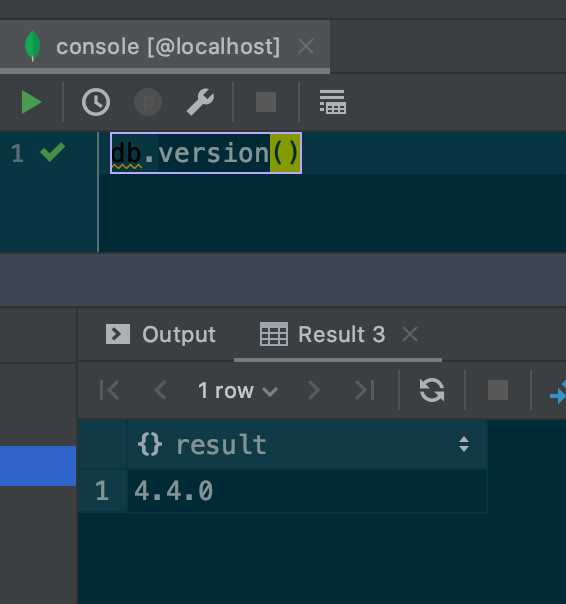
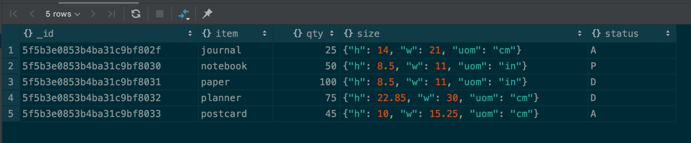
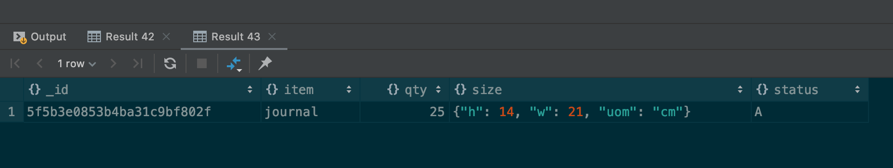
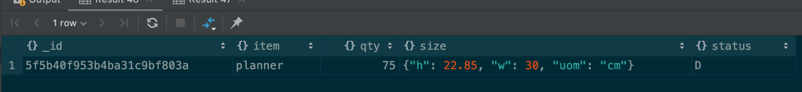
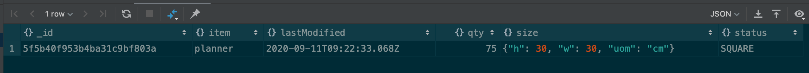
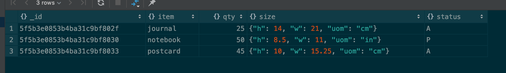
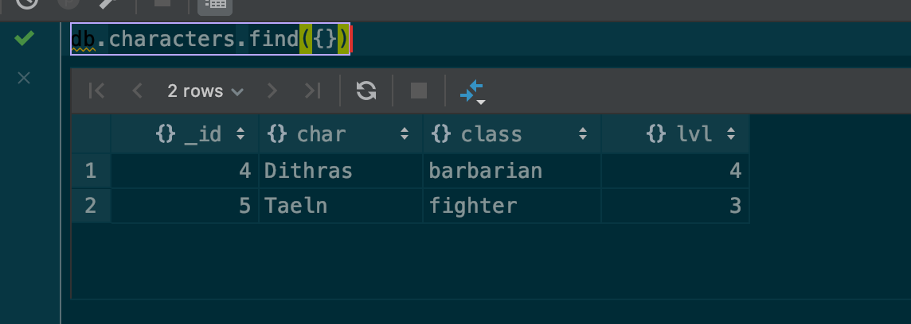

# DAT250: Experience Assignment 3

Author: Kenneth Fossen 577136@stud.hvl.no

## Tasks

| Task | Done |
| --- | --- |
| Getting started | :white_check_mark: |
| Installation: Mongo DB| :white_check_mark: |
| Experiment 1: MongoDB CRUD operations | :white_check_mark: |
| Experiment 2: Aggregation focus on Map-Reduce | :white_check_mark: |

Noting on following topics:

- Technical problems that you encountered during installation and use of MongoDB and how you resolved

- Screenshots for:

  - The correct validation of the installation package (https://docs.mongodb.com/manual/tutorial/verify-mongodb-packages/)

  - Relevant results obtained during Experiment 1 (it is not necessary to put a single screenshot on each substep, but at least one significant from each CRUD operation).

  - Experiment 2 example working and the additional Map-reduce operation (and its result) developed by each of you.

- Reason about why your implemented Map-reduce operation in Experiment 2 is useful and interpret the collection obtained. 

- Any pending issues with this assignment which you did not manage to solve

## Getting started

0. Switch Database
1. Populate a collection (Insert)
2. Select All Documents
3. Specify Equality Matches
4. Specify Fields to Return (Projection)

Followed the guide and did the above.

## Installation: MongoDB Database Server

```sh
docker pull mongo
docker run -d --name mongodb \
    -e MONGO_INITDB_ROOT_USERNAME=sa \
    -e MONGO_INITDB_ROOT_PASSWORD=supersecret \
    -p 127.0.0.1:27017:27017/tcp \
    mongo

# to start and stop after this
docker start mongodb
docker stop mongodb
```

```sh
root@e7c874a2e230:/# mongo --version
MongoDB shell version v4.4.0
Build Info: {
    "version": "4.4.0",
    "gitVersion": "563487e100c4215e2dce98d0af2a6a5a2d67c5cf",
    "openSSLVersion": "OpenSSL 1.1.1  11 Sep 2018",
    "modules": [],
    "allocator": "tcmalloc",
    "environment": {
        "distmod": "ubuntu1804",
        "distarch": "x86_64",
        "target_arch": "x86_64"
    }
}
```



Installed this way because I don't want a DB cluttering up my OS, hence pulling it down in containers is better so I can remove this later with out any problems.

Have not SHA256 verified the binaries as this was a official docker image from MongoDB.
[Official Docker Image](https://hub.docker.com/_/mongo/)

## Experiment 1: MongoDB CRUD operations

CRUD operations stands for create, read, update, and delete documents.

Follow and do the tutorials through the CRUD operations section:

https://docs.mongodb.com/manual/tutorial/insert-documents/ :white_check_mark:

```javascript
db.inventory.find({}) // returns 0
db.inventory.insertMany( [
   { item: "journal", qty: 25, size: { h: 14, w: 21, uom: "cm" }, status: "A" },
   { item: "notebook", qty: 50, size: { h: 8.5, w: 11, uom: "in" }, status: "P" },
   { item: "paper", qty: 100, size: { h: 8.5, w: 11, uom: "in" }, status: "D" },
   { item: "planner", qty: 75, size: { h: 22.85, w: 30, uom: "cm" }, status: "D" },
   { item: "postcard", qty: 45, size: { h: 10, w: 15.25, uom: "cm" }, status: "A" },
] );
db.inventory.find({})

```



https://docs.mongodb.com/manual/tutorial/query-documents/ :white_check_mark:

```javascript
db.inventory.find({}) // returns 0
db.inventory.insertMany( [
   { item: "journal", qty: 25, size: { h: 14, w: 21, uom: "cm" }, status: "A" },
   { item: "notebook", qty: 50, size: { h: 8.5, w: 11, uom: "in" }, status: "P" },
   { item: "paper", qty: 100, size: { h: 8.5, w: 11, uom: "in" }, status: "D" },
   { item: "planner", qty: 75, size: { h: 22.85, w: 30, uom: "cm" }, status: "D" },
   { item: "postcard", qty: 45, size: { h: 10, w: 15.25, uom: "cm" }, status: "A" },
] );
db.inventory.find({ qty: {$lt : 30 }})
```


https://docs.mongodb.com/manual/tutorial/update-documents/ :white_check_mark:
```javascript
db.inventory.find({item:"planner"})
db.inventory.update(
    {item: "planner"},
    {
    $set : { "size.h" : 30, "size.w" : 30, status: "SQUARE" },
    $currentDate: { lastModified: true}
    }
)
db.inventory.find({item:"planner"})
```



https://docs.mongodb.com/manual/tutorial/remove-documents/ :white_check_mark:

```javascript
db.inventory.find({}) // returns 0
db.inventory.insertMany( [
   { item: "journal", qty: 25, size: { h: 14, w: 21, uom: "cm" }, status: "A" },
   { item: "notebook", qty: 50, size: { h: 8.5, w: 11, uom: "in" }, status: "P" },
   { item: "paper", qty: 100, size: { h: 8.5, w: 11, uom: "in" }, status: "D" },
   { item: "planner", qty: 75, size: { h: 22.85, w: 30, uom: "cm" }, status: "D" },
   { item: "postcard", qty: 45, size: { h: 10, w: 15.25, uom: "cm" }, status: "A" },
] );
db.inventory.find({}) //returns 5
db.inventory.deleteMany({ qty: { $gt: 50 } })
db.inventory.find() //returns 3 se img
```


https://docs.mongodb.com/manual/core/bulk-write-operations/ :white_check_mark:
```javascript
try {
   db.characters.bulkWrite(
      [
         { insertOne :
            {
               "document" :
               {
                  "_id" : 4, "char" : "Dithras", "class" : "barbarian", "lvl" : 4
               }
            }
         },
         { insertOne :
            {
               "document" :
               {
                  "_id" : 5, "char" : "Taeln", "class" : "fighter", "lvl" : 3
               }
            }
         },
         { updateOne :
            {
               "filter" : { "char" : "Eldon" },
               "update" : { $set : { "status" : "Critical Injury" } }
            }
         },
         { deleteOne :
            { "filter" : { "char" : "Brisbane"} }
         },
         { replaceOne :
            {
               "filter" : { "char" : "Meldane" },
               "replacement" : { "char" : "Tanys", "class" : "oracle", "lvl" : 4 }
            }
         }
      ]
   );
}
catch (e) {
   print(e);
}
```



## Experiment 2: Aggregation

Aggregation operations process data records and return computed results. Aggregation operations group values from multiple documents together, and can perform a variety of operations on the grouped data to return a single result. MongoDB provides three ways to perform aggregation: the aggregation pipeline, the map-reduce function, and single purpose aggregation methods.

We will focus on Map-Reduce for this experiment, but you are encouraged to take a look at Aggregation Pipeline.

Map-Reduce
First, read the material provided in:

https://docs.mongodb.com/manual/aggregation/

https://docs.mongodb.com/manual/core/map-reduce/

Complete the Examples tutorial (the Aggregation alternative part is not mandatory, but you can do it) from:

https://docs.mongodb.com/manual/tutorial/map-reduce-examples/

Add an additional operation developed by you and show its the result given by its execution.

Example of a mapReduce function, for my Pearshoppers.

```javascript
db.orders.insertMany([
   { _id: 1, cust_id: "Ant O. Knee", ord_date: new Date("2020-03-01"), price: 25, items: [ { sku: "oranges", qty: 5, price: 2.5 }, { sku: "apples", qty: 5, price: 2.5 } ], status: "A" },
   { _id: 2, cust_id: "Ant O. Knee", ord_date: new Date("2020-03-08"), price: 70, items: [ { sku: "oranges", qty: 8, price: 2.5 }, { sku: "chocolates", qty: 5, price: 10 } ], status: "A" },
   { _id: 3, cust_id: "Busby Bee", ord_date: new Date("2020-03-08"), price: 50, items: [ { sku: "oranges", qty: 10, price: 2.5 }, { sku: "pears", qty: 10, price: 2.5 } ], status: "A" },
   { _id: 4, cust_id: "Busby Bee", ord_date: new Date("2020-03-18"), price: 25, items: [ { sku: "oranges", qty: 10, price: 2.5 } ], status: "A" },
   { _id: 5, cust_id: "Busby Bee", ord_date: new Date("2020-03-19"), price: 50, items: [ { sku: "chocolates", qty: 5, price: 10 } ], status: "A"},
   { _id: 6, cust_id: "Cam Elot", ord_date: new Date("2020-03-19"), price: 35, items: [ { sku: "carrots", qty: 10, price: 1.0 }, { sku: "apples", qty: 10, price: 2.5 } ], status: "A" },
   { _id: 7, cust_id: "Cam Elot", ord_date: new Date("2020-03-20"), price: 25, items: [ { sku: "oranges", qty: 10, price: 2.5 } ], status: "A" },
   { _id: 8, cust_id: "Don Quis", ord_date: new Date("2020-03-20"), price: 75, items: [ { sku: "chocolates", qty: 5, price: 10 }, { sku: "apples", qty: 10, price: 2.5 } ], status: "A" },
   { _id: 9, cust_id: "Don Quis", ord_date: new Date("2020-03-20"), price: 55, items: [ { sku: "carrots", qty: 5, price: 1.0 }, { sku: "apples", qty: 10, price: 2.5 }, { sku: "oranges", qty: 10, price: 2.5 } ], status: "A" },
   { _id: 10, cust_id: "Don Quis", ord_date: new Date("2020-03-23"), price: 25, items: [ { sku: "oranges", qty: 10, price: 2.5 } ], status: "A" }
])

var mapCustPrice = function() {
   emit(this.cust_id, this.price);
};

var reduceToSum = function(keyCustId, valuesPrices) {
   return Array.sum(valuesPrices);
};

db.orders.mapReduce(
    mapCustPrice,
    reduceToSum,
    {
        query: { "items.sku" : "pears" },
        out: "pears_shoppers"
    }
)

 > db.pears_shoppers.find()
{ "_id" : "Busby Bee", "value" : 50 }
```

## Pending issues

No