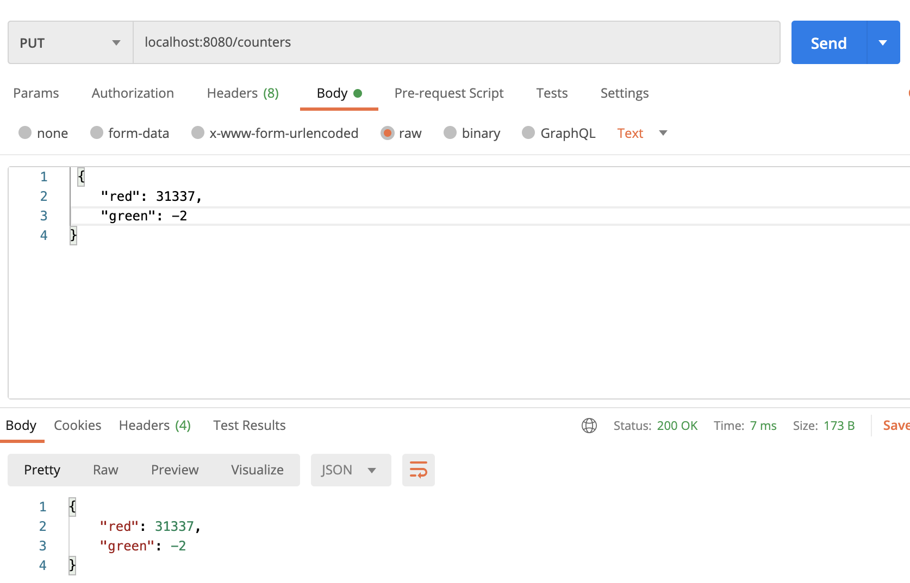
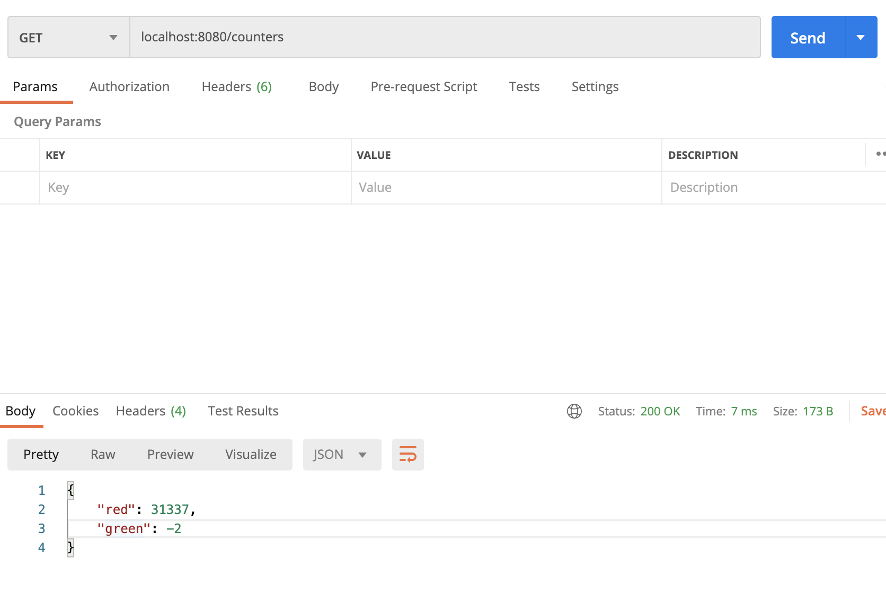
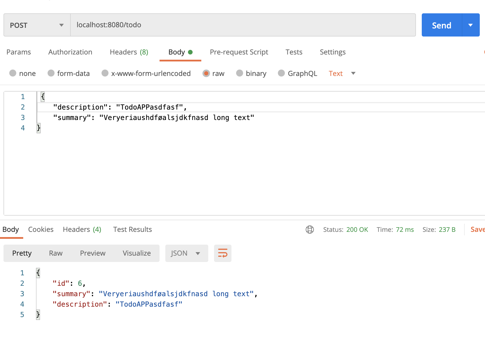
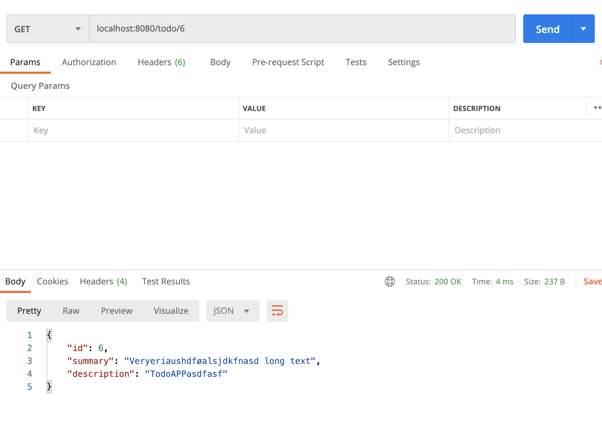
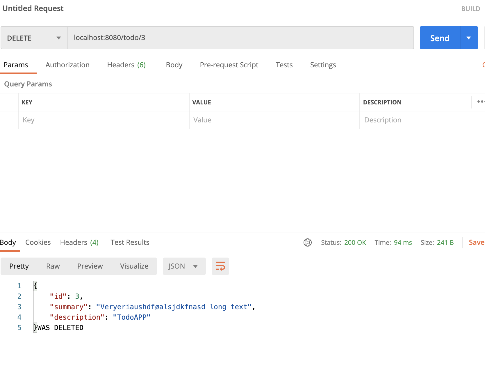
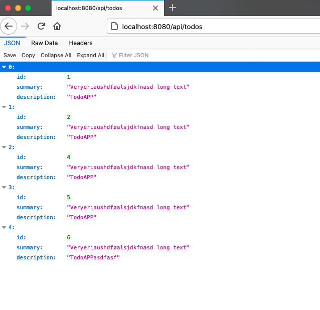

# DAT250: Experience Assignment 4

Author: Kenneth Fossen 577136@stud.hvl.no

## Tasks

| Task | Done |
| --- | --- |
| Getting started |  |
| Experiment 1: Spark/Java Framework project and Postman | :white_check_mark: |
| Experiment 2: REST API for TODO-items | :white_check_mark: |
| Experiment 3: Swagger (optional)| :white_check_mark: |
| Experiment 4: XML representation (optional) | |

Noting on following topics:

- technical problems that you encountered during installation and use of Java Persistence Architecture (JPA) and how you resolved

- a link to your code for experiment 2-4 above

- Any pending issues with this assignment which you did not manage to solve

## Experiment 1: Spark/Java Framwork project and Postman

Clone the Spark/Java red-green-counter example from the lectures :white_check_mark:

`http put => http://localhost:8080/counters`

`http get  => http://localhost:8080/counters`

## Experiment 2: REST API for TODO-items

[Todo REST API](todos/)

## Experiment 3: Swagger (optional)

[Todo SWAGGER API](todos/)

## Experiment 4: XML representation (optional)

Not done

## Pending issues

No 